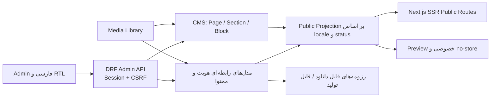

# برنامهٔ جامع توسعه و تسک‌لیست فنی TahaMohamadi.ir

**نسخه:** 1.0

**تاریخ:** 2026-07-29

**وضعیت:** مرجع پیشنهادی اجرا

**روش زمان‌بندی:** بدون تقویم؛ مبتنی بر اولویت، وابستگی و اندازهٔ نسبی

**استک قطعی:** Django 5 + Django REST Framework + PostgreSQL + Redis/Celery + Next.js App Router + React + TypeScript + Tailwind CSS v4 + shadcn/ui (New York/Radix/Lucide)

---

## 1. هدف و تعریف محصول

این محصول یک وب‌سایت شخصی عمومی به‌همراه CMS اختصاصی است که باید هویت واقعی طه محمدی را در محل تلاقی چهار حوزه نشان دهد:

1. مهندسی نرم‌افزار، Backend و سامانه‌های سازمانی؛
2. هوش مصنوعی کاربردی، LLM محلی، RAG و NLP-to-SQL؛
3. پژوهش HCI، مصورسازی اطلاعات و سیستم‌های تصمیم‌یار؛
4. طراحی محصول، UI/UX و داستان‌سرایی با داده.

سایت نباید یک Portfolio عمومیِ قابل‌تعویض با نام هر فرد دیگری باشد. ادعاهای حرفه‌ای باید با شواهد قابل‌پیگیری مانند پروژه، تجربه، مقاله، پژوهش، گواهی یا مطالعهٔ موردی پشتیبانی شوند. در عین حال، هیچ نام، عنوان، زندگی‌نامه، تجربه، مهارت، لینک، رسانه، متن Landing، اطلاعات تماس، SEO یا Navigation متعلق به صاحب سایت نباید در کد React یا Python هاردکد شود.

### 1.1 معیار موفقیت محصول

- بازدیدکننده ظرف چند ثانیه هویت حرفه‌ای، تخصص اصلی و مسیرهای مشاهدهٔ شواهد را درک کند.
- پژوهشگر یا استاد بتواند سوابق آکادمیک، علایق پژوهشی، آثار و پروژه‌های تحقیقاتی را بیابد.
- کارفرما یا همکار صنعتی بتواند تجربه، فناوری‌ها، مطالعات موردی و رزومهٔ مناسب را مشاهده کند.
- مدیر سایت بتواند تمام داده‌های عمومی، ترتیب نمایش، ترجمه، رسانه، SEO، وضعیت انتشار و فایل‌های رزومه را از Admin مدیریت کند.
- فارسی و انگلیسی دو محتوای مستقل باشند؛ نبود ترجمه با fallback پنهان نشود.
- انتشار فقط از دادهٔ تأییدشده و رسانهٔ واقعی انجام شود؛ آمار، لوگو، نتیجه یا تصویر ساختگی ممنوع است.

### 1.2 حریم خصوصی و استفاده از اسناد شخصی

- رزومه‌ها و متن کتاب صرفاً منبع شناخت هویت و seed اولیه‌اند و در مخزن ذخیره یا عیناً منتشر نمی‌شوند.
- seed اولیه فقط داده‌های عمومی و مجاز را به حالت `draft` وارد می‌کند و انتشار آن نیازمند تأیید Admin است.
- ایمیل حرفه‌ای می‌تواند عمومی باشد؛ تلفن و مشخصات معرف‌ها به‌صورت پیش‌فرض خصوصی‌اند و در Public API هرگز برگردانده نمی‌شوند.
- متن کامل کتاب، فایل اصلی و فصل‌های آن خارج از دامنهٔ انتشار فعلی است. در صورت ایجاد رکورد، وضعیت آن `draft/private` خواهد بود تا تصمیم انتشار جداگانه ثبت شود.
- هر فیلد حساس دارای سطح نمایش صریح است؛ «وجود داده در دیتابیس» به معنی «اجازهٔ انتشار» نیست.

### 1.3 مرجع تصمیم‌گیری

ترتیب مرجع در زمان تعارض:

1. `.kiro/specs/react-django-rewrite/requirements.md`، سپس `design.md` و `tasks.md`؛
2. این سند و تصمیم‌های معماری فعال در `docs/architecture/`؛
3. قراردادهای API، serializerها، migrationها و تست‌های موجود؛
4. مستندات پشتیبان؛
5. اسناد Spring/Vue آرشیوشده فقط منبع ایده‌اند و مرجع اجرا نیستند.

---

## 2. اصول معماری و مرزهای قطعی

### 2.1 اصول غیرقابل مذاکره

- معماری اصلی CMS یعنی `Page → Section → Block` حفظ می‌شود؛ بازنویسی به یک سند JSON آزاد انجام نمی‌شود.
- `Block.settings` فقط برای تنظیمات تایپ‌شدهٔ همان block است و با JSON Schema سمت Backend اعتبارسنجی می‌شود.
- داده‌های دامنه‌ای مانند Experience، Skill، Publication و ResearchProject مدل رابطه‌ای مستقل دارند؛ آن‌ها داخل block کپی نمی‌شوند.
- blockهای collection فقط منبع، فیلتر، ترتیب و محدودیت را نگه می‌دارند و دادهٔ منتشرشده را در زمان projection می‌خوانند.
- Public API فقط رکوردهای `published`، locale کامل و رسانهٔ مجاز را برمی‌گرداند.
- مدل‌های هویتی دارای `visibility: public | unlisted | private` مستقل از workflow status هستند؛ Public API فقط `published + public` را برمی‌گرداند.
- Preview خصوصی، کوتاه‌عمر، locale-bound، `no-store` و `noindex` است.
- Admin با session cookie، CSRF، Django permissions، optimistic locking و audit log کار می‌کند؛ token در Local Storage ممنوع است.
- migrationها افزایشی و rollbackپذیرند؛ حذف فیلد/نوع block فقط پس از دورهٔ سازگاری انجام می‌شود.
- Next.js Server Components و `fetch` برای Public SSR حفظ می‌شوند؛ state client عمومی بی‌دلیل اضافه نمی‌شود.

### 2.2 جریان داده

### 2.3 ماژول‌های Backend هدف

#### `apps.identity` — هویت و رزومه

- `SiteProfile`: نام نمایشی، عنوان حرفه‌ای، biography کوتاه/بلند، محل، ایمیل عمومی، portrait، CTAها و تنظیمات نمایش؛ همهٔ متن‌ها با فیلد مستقل `fa/en`.
- `SocialLink`: پلتفرم، label، URL امن، ترتیب، فعال/غیرفعال.
- `SkillGroup` و `Skill`: دسته‌بندی، نام، توضیح، سطح صرفاً توصیفی، featured، ترتیب و ارتباط با شواهد؛ درصد مهارت ساختگی ممنوع.
- `Experience` و `ExperienceHighlight`: سازمان، نقش، بازه، مکان، خلاصه، دستاوردها، فناوری‌ها، رسانه و ترتیب.
- `Education`, `Certification`, `Affiliation`, `LanguageProficiency`: رکوردهای قابل مرتب‌سازی و انتشار مستقل.
- `ResearchInterest` و `ResearchProject`: مسئله، نقش، روش، وضعیت، خروجی، پیوند به مقاله/مطالعهٔ موردی و رسانه.
- `Publication`: نوع `article | book | manuscript | thesis | report`، workflow status، visibility، عنوان، نویسندگان، چکیده، سال، ناشر/venue، DOI/ISBN، cover، URL و فایل اختیاری.
- `ResumeVariant`: مخاطب `general | academic | industry`، عنوان، نسخه، فایل PDF/DOCX، workflow status، visibility و مجموعهٔ آیتم‌های منتخب برای تولید آینده.

#### `apps.siteconfig` — داده‌های سراسری قابل مدیریت

- `SiteSettings`: نام سایت، دامنه، locale پیش‌فرض، SEO defaults، تصویر OG پیش‌فرض و اطلاعات footer.
- `NavigationItem`: محل `header | footer`, locale، label، مسیر داخلی امن یا URL خارجی، parent، ترتیب و وضعیت.
- `RedirectRule`: مسیر قدیم، مقصد هم‌دامنهٔ معتبر، کد 301/302، وضعیت و audit.
- هیچ label محتوایی یا CTA شخصی در componentها هاردکد نمی‌شود؛ فقط متن عملیاتی خود Admin در فایل i18n فرانت باقی می‌ماند.

#### ماژول‌های موجود

- `cms`: ترکیب صفحه و block registry؛ منبع دادهٔ هویتی را reference می‌کند.
- `blog`: مقاله و Topic؛ taxonomy عمومی فقط بر پایهٔ Topic موجود توسعه می‌یابد و Category/Tag جدید بدون مدل و نیاز اثبات‌شده ساخته نمی‌شود.
- `portfolio`: CaseStudy و فناوری‌ها؛ برای شواهد صنعتی و محصولی.
- `media`: فایل، metadata محلی، usage، archive/replacement و orphan report.
- `workflow`: transition، revision، schedule، preview، translation status و audit؛ endpoint موازی ساخته نمی‌شود.
- `contact`: ماژول جدید برای persistence پیام‌ها؛ endpoint عمومی فعلی حفظ می‌شود.

### 2.4 قراردادهای API هدف

#### Public API

| Contract | رفتار |
|---|---|
| `GET /api/public/site/?locale=fa|en` | SiteSettings، SiteProfile عمومی، Navigation و SocialLinkهای فعال؛ هیچ فیلد خصوصی ندارد. |
| `GET /api/public/pages/{slug}/?locale=...` | قرارداد فعلی؛ slug همان locale را جست‌وجو می‌کند و فقط projection منتشرشده را می‌دهد. |
| `GET /api/public/identity/{resource}/?locale=...` | فهرست‌های experience، education، skills، certifications و research interests با pagination/filter محدود. |
| `GET /api/public/research/` و `/{slug}/` | پروژه‌های پژوهشی منتشرشده و locale-complete. |
| `GET /api/public/publications/` و `/{slug}/` | آثار منتشرشده؛ فایل private یا draft هیچ‌گاه expose نمی‌شود. |
| `GET /api/public/resumes/{slug}/?locale=...` | metadata نسخهٔ منتشرشده و لینک فایل مجاز؛ تلفن/معرف فقط در فایل تأییدشده ممکن است وجود داشته باشد. |
| `GET /api/public/blog/topics/?locale=...` | endpoint مفقود فعلی برای Topicهای قابل‌استفاده. |
| `GET /api/public/blog/articles/?locale=&page=&page_size=&topic=&q=` | جست‌وجوی عنوان/خلاصه و فیلتر Topic؛ query state قابل اشتراک در URL. |
| `POST /api/public/contact/` | قرارداد ورودی فعلی حفظ می‌شود؛ پیام ابتدا ذخیره، سپس اعلان ایمیل به‌صورت fail-safe ارسال می‌شود. |

#### Admin API

- CRUD استاندارد و paginated برای همهٔ منابع identity/siteconfig با search، filter، ordering و `version`.
- مسیرهای `POST publish`, `POST archive` و workflow از state machine موجود استفاده می‌کنند؛ تغییر status با PATCH آزاد ممنوع است.
- `GET /api/admin/media/{id}/usage/`: مراجع مصرف با نوع محتوا، عنوان، locale و مسیر Admin.
- `POST /api/admin/media/{id}/replace/`: جایگزینی کنترل‌شده پس از نمایش impact، با transaction و audit.
- `GET /api/admin/contact-messages/` و detail؛ actionهای `mark-read` و `archive`، بدون endpoint حذف سخت در MVP.
- endpointهای workflow موجود برای transition، revision compare/restore، schedule/cancel، preview token و translation status دوباره‌سازی نمی‌شوند.
- همهٔ خطاها Problem Details یکدست دارند؛ conflict با `409` و `current_version` به UI نگاشت می‌شود.

### 2.5 TypeScript و state

- DTOهای Public و Admin از یک فایل پراکنده و `Record<string, unknown>` به typeهای دامنه‌ای تقسیم می‌شوند.
- برای blockها، discriminated union بر اساس `block_type` ساخته می‌شود؛ Inspector حق cast آزاد تنظیمات را ندارد.
- نتیجهٔ fetch عمومی سه حالت صریح دارد: `success | not_found | unavailable`؛ خطای شبکه به‌عنوان 404 یا محتوای خالی پنهان نمی‌شود.
- TanStack Query فقط برای server-state Admin و پس از spike یک صفحه استفاده می‌شود؛ Public SSR با RSC/fetch باقی می‌ماند.
- فرم‌های بزرگ با React Hook Form + Zod ساخته می‌شوند، اما serializer Backend مرجع نهایی validation است.

---

## 3. راهبرد UI/UX، هویت بصری و shadcn/ui

### 3.1 جهت طراحی

جهت اصلی «Academic Editorial حرفه‌ای، خلاق و کاربردی» است. جذابیت از تایپوگرافی، ترکیب‌بندی، شواهد واقعی، ریتم و تعامل معنادار به‌دست می‌آید؛ نه از dashboard تزئینی، metric ساختگی، glow، cursor سفارشی یا انیمیشن دائمی.

#### سایت عمومی

- Light-first؛ Dark Mode تا ثبت تصمیم مستقل خارج از MVP است.
- فارسی: Vazirmatn؛ انگلیسی: Inter؛ کد و دادهٔ فنی: JetBrains Mono.
- Hero با یک H1، معرفی کوتاه قابل مدیریت، حداکثر دو CTA و یک media واقعی با alt همان locale.
- سه محور هویتی به‌صورت evidence-led: Engineering، Applied AI/Research و Human-Centered Data Products.
- Portfolio Grid برای Selected Work؛ صفحهٔ مقاله/پژوهش با measure خوانا و hierarchy آکادمیک.
- موشن فقط برای بازخورد، تغییر state، transition کوتاه و reveal محدود؛ `prefers-reduced-motion` نسخهٔ بدون حرکت دارد.
- Custom Cursor، Aurora، Typewriter دائمی، Parallax و Counter نمایشی از قالب پیش‌فرض حذف می‌شوند.

#### Admin

- رابط فارسی، `lang="fa"` و `dir="rtl"`؛ فیلدهای انگلیسی و URL/DOI/کد به‌صورت LTR-isolated.
- متراکم، آرام، keyboard-first و task-oriented؛ dashboard فقط دادهٔ واقعی و اقدام‌پذیر دارد.
- Navigation ثابت، breadcrumb، command palette، میانبر ذخیره و پرش بین localeها.
- listها با search/filter/sort/pagination و حفظ state در URL؛ table در موبایل به list/card عملیاتی تبدیل می‌شود.
- هر صفحه چهار state صریح دارد: loading، empty، error و success/ready.
- destructive action با AlertDialog و توضیح اثر؛ detail/filter در Sheet و در موبایل Drawer.

### 3.2 قواعد HCI

- **Visibility of system status:** وضعیت ذخیره، autosave، انتشار، upload و job همیشه قابل مشاهده است.
- **Match with the real world:** به‌جای ID خام، نام محتوا، thumbnail، locale و مسیر نمایش داده می‌شود.
- **User control:** لغو upload/schedule، restore-as-draft، undo محدود و خروج امن از فرم dirty.
- **Error prevention:** پیش از publish، checklist ترجمه، alt، slug، SEO و link safety اجرا می‌شود.
- **Recognition over recall:** picker، combobox و قالب block جای ورود شناسه، CSV یا JSON خام را می‌گیرد.
- **Progressive disclosure:** تنظیمات رایج ابتدا؛ SEO، motion و advanced settings در بخش جدا.
- **Consistency:** actionها، status badgeها، فرم‌ها، timestampها و خطاها در تمام ماژول‌ها الگوی مشترک دارند.
- **Accessibility:** WCAG 2.2 AA، contrast حداقل 4.5:1، target حداقل 44×44، focus visible، keyboard reorder، landmark و heading صحیح.

### 3.3 سیاست shadcn/ui

- تنظیم موجود `new-york + radix + lucide + cssVariables + Tailwind v4` حفظ می‌شود.
- پیش از افزودن component، docs رسمی بررسی، `add --dry-run` اجرا و diff بازبینی می‌شود؛ overwrite فایل سفارشی بدون تأیید ممنوع است.
- primitiveهای موردنیاز: `field`, `alert`, `alert-dialog`, `tabs`, `table`, `empty`, `sheet`, `drawer`, `dropdown-menu`, `popover`, `tooltip`, `separator`, `checkbox`, `switch`, `radio-group`, `scroll-area`, `pagination`, `breadcrumb`, `command` و `sonner`.
- فرم: `FieldGroup → Field → FieldLabel/FieldDescription/FieldError`؛ روی wrapper از `data-invalid` و روی control از `aria-invalid` استفاده می‌شود.
- فاصله‌گذاری با `flex/grid + gap` است؛ `space-x/y` و رنگ خام `gray/red/blue/green` در feature code حذف می‌شوند.
- فقط Lucide؛ icon button حتماً accessible name دارد و iconها با سازوکار component اندازه می‌گیرند.
- statusها از semantic tokenهای `success`, `warning`, `danger`, `info` استفاده می‌کنند و فقط با رنگ منتقل نمی‌شوند.
- Card فقط برای مجموعهٔ رکوردها؛ prose و section معمولی داخل cardهای تو در تو محصور نمی‌شوند.

### 3.4 معماری Landing Page

ترتیب پیش‌فرض Home، کاملاً قابل مدیریت از Page Builder:

1. **Identity Hero:** نام، positioning، bio کوتاه، portrait/visual و CTAهای «مشاهدهٔ کارها» و «تماس».
2. **Evidence Pillars:** سه حوزهٔ تخصصی با لینک به شواهد واقعی، نه نوار درصد مهارت.
3. **Selected Work:** پروژه‌های منتخب صنعتی، AI و داده‌محور با نقش، مسئله و نتیجهٔ قابل اثبات.
4. **Research Focus:** PARS-SQL/VTD-Edge، HCI، Edge AI و حوزه‌های پژوهشی منتشرشده.
5. **Publications & Writing:** آثار و نوشته‌های منتشرشده؛ draft/private نمایش داده نمی‌شود.
6. **Experience Snapshot:** timeline خلاصه با لینک به Resume/About.
7. **Latest Writing:** آخرین مقاله‌ها، فقط در صورت وجود دادهٔ همان locale.
8. **Contact CTA:** ایمیل حرفه‌ای و فرم تماس؛ تلفن/معرف عمومی نیست.

اگر یک collection خالی یا locale ناقص باشد، کل section حذف می‌شود؛ placeholder عمومی یا fallback زبان دیگر نمایش داده نمی‌شود.

### 3.5 معماری اطلاعات Admin

| بخش | مسیر پیشنهادی | عملیات اصلی |
|---|---|---|
| Dashboard | `/admin` | کارهای نیازمند اقدام، محتوای ناقص، scheduleهای ناموفق و فعالیت اخیر واقعی. |
| هویت | `/admin/profile` | نام، positioning، bio، portrait، ایمیل عمومی، CTA و SocialLink. |
| سابقه و توانایی‌ها | `/admin/experience`, `/skills`, `/education`, `/certifications` | CRUD، ترتیب، featured، locale completeness و اتصال به شواهد. |
| پژوهش و آثار | `/admin/research`, `/publications` | پروژه، علاقهٔ پژوهشی، مقاله/کتاب/manuscript، visibility، media و ارتباط‌ها. |
| Portfolio | `/admin/portfolio` | CaseStudy، فناوری، gallery، outcome، related و workflow. |
| Blog | `/admin/blog`, `/admin/blog/topics` | مقاله، Topic، editor، SEO، preview و انتشار. |
| Page Builder | `/admin/pages` | Page/Section/Block، template، collection source، preview و ترجمه. |
| Media | `/admin/media` | upload، metadata، usage، replacement، archive و orphan. |
| Resume | `/admin/resumes` | variant، انتخاب محتوا، فایل نسخه‌دار، visibility و انتشار. |
| تماس | `/admin/contact` | inbox، read/archive، search و retention. |
| انتشار | `/admin/workflow`, `/translations`, `/scheduled` | transition، queue ترجمه، revision، schedule و preview token. |
| تنظیمات سایت | `/admin/settings/site`, `/navigation`, `/redirects` | SEO defaults، header/footer، menu، redirect و اطلاعات عمومی. |
| Audit | `/admin/audit` | actor، action، محتوا، locale، قبل/بعد، زمان و reason؛ بدون افشای payload حساس. |

تمام این صفحات باید list/detail/create/edit مشخص، permission، dirty-state guard، optimistic conflict، loading/empty/error و تست keyboard داشته باشند. هیچ دادهٔ محتوایی فقط از طریق Django shell یا migration قابل مدیریت باقی نمی‌ماند.

---

## 4. نقشهٔ اجرا و تسک‌لیست تفصیلی

### 4.1 قرارداد اندازه و اولویت

- **S:** تغییر کوچک و محصور؛ یک قرارداد یا component.
- **M:** یک vertical slice با Backend/Frontend/Test محدود.
- **L:** چند مدل/route/flow مرتبط با migration و E2E.
- **XL:** قابلیت مرکب؛ باید پیش از اجرا به sliceهای M/L شکسته شود.
- **P0:** مانع اعتماد یا توسعه؛ **P1:** هستهٔ محصول؛ **P2:** تکمیل حرفه‌ای؛ **P3:** رشد کنترل‌شده.

هر task باید یک owner، dependency، فایل‌های در scope، تست RED، پیاده‌سازی GREEN، acceptance evidence و rollback note داشته باشد.

### 4.2 وضعیت اجرای جاری (2026-07-29)

علامت‌ها: **✅** تکمیل و شواهد پذیرش موجود؛ **🟡** پیاده‌سازی شده اما یک یا چند
gate در [فهرست اعتبارسنجی معوق](../status/deferred-validation.md) باقی است؛
**⬜** انجام‌نشده یا وابسته به رفع blocker.

| ID | وضعیت | شواهد / اقدام بعدی |
|---|---|---|
| R0-01 | 🟡 | محدودهٔ فایل‌های task-owned برای هر commit حفظ شده است؛ baseline کلی هنوز به‌علت ورک‌تری بسیار dirty و `git diff --check` قرمز، قابل بستن نیست. |
| R0-02 | ⬜ | `CustomCursor` همچنان در locale layout موجود است؛ فایل layout تغییرات مستقل دارد و نیازمند QA hydration است. |
| R0-03 | 🟡 | locale واقعی و تفکیک 404 از failure در commit `87360f6` پیاده شد؛ browser smoke باقی است. |
| R0-04 | ⬜ | `PublicLayout` و صفحات عمومی ownership تکراری `main` دارند؛ وابسته به تثبیت semantic Hero در R0-10 است. |
| R0-05 | 🟡 | public topics، `q` و URL state در commit `1f8bce2` پیاده شد؛ 17 pytest مرتبط روی PostgreSQL Compose پاس شد و browser/a11y QA باقی است. |
| R0-06 | 🟡 | usage و orphan detection اکنون CMS/Blog/Portfolio را پوشش می‌دهند؛ 32 تست PostgreSQL Compose پاس شد. QA رابط Admin با session/CSRF واقعی باقی است. |
| R0-07 | ✅ | seed دیگر placeholder media نمی‌سازد و رکوردهای شکستهٔ تاریخی `media/seed/` را فقط در صورت نبود فایل پاک‌سازی می‌کند؛ test قرارداد پاس شد. |
| R0-08 | ✅ | target تست Compose با فرمان واحد فعال است؛ اجرای کامل مجدد در 2026-07-29، 730/730 تست PostgreSQL را پاس کرد. |
| R0-09 | 🟡 | scrub صریح Sentry و تست واحد آن در حال پیاده‌سازی است؛ ارسال واقعی server/client به پروژهٔ Sentry نیازمند DSN غیرمحلی است. |
| R0-10 | ⬜ | ۵ failure فعلی BlockRenderer ثبت شده؛ فایل‌های Hero/Quote تغییرات مستقل دارند و باید semantic contract را بازگردانند. |

#### وضعیت شروع R1

| ID | وضعیت | شواهد / اقدام بعدی |
|---|---|---|
| R1-01 | 🟡 | مدل‌ها، migration، projection عمومیِ published-only و Admin CRUD با optimistic 409 پیاده شد؛ public viewport QA و محتوای واقعی باقی است. |
| R1-02 | 🟡 | Experience/Education/Certification/Affiliation/LanguageProficiency با migration، projection عمومیِ published-only و CRUD Admin پیاده شد؛ QA مرورگر و دادهٔ واقعی باقی است. |
| R1-03 | 🟡 | ResearchProject/ResearchInterest/Publication با migration، projection عمومیِ published-only و CRUD Admin پیاده شد؛ routeهای عمومی اختصاصی، frontend و دادهٔ تأییدشده باقی است. |
| R1-04 | 🟡 | ResumeVariant با migration، CRUD Admin و public projection فقط برای `published + active asset` پیاده شد؛ فایل‌های واقعی و QA دانلود باقی است. |
| R1-05 | 🟡 | `apps.siteconfig` با migration، API عمومی published-only، CRUD محافظت‌شده و middleware redirect امن پیاده شد؛ اتصال Frontend و QA مرورگر باقی است. |
| R1-06 | 🟡 | aggregate عمومی site+identity با ETag/Cache-Control و suppress ترجمهٔ ناقص پیاده شد؛ resource endpointهای تفصیلی و اتصال Frontend باقی است. |
| R1-07 | 🟡 | Admin CRUD منابع جدید اکنون filter/search/ordering و optimistic 409 دارد؛ QA session/CSRF و صفحه‌های Admin باقی است. |
| R1-08 | 🟡 | seed idempotent برای identity/siteconfig فقط رکوردهای draft حداقلی و بدون دادهٔ تماس/سند/asset می‌سازد؛ بازبینی و انتشار واقعی باقی است. |
| R1-09 | 🟡 | API محافظت‌شدهٔ `seed-review` وضعیت draft و کامل‌بودن دو locale را گزارش می‌کند و auto-publish را صریحاً ممنوع می‌سازد؛ UI checklist باقی است. |
| R1-10 | 🟡 | collection block اکنون source/filter/limit/order محدود دارد و منابع identity منتشرشده را بدون ID خام resolve می‌کند؛ renderer و sourceهای Blog/Portfolio باقی است. |

### R0 — تثبیت Runtime و قراردادهای شکسته

| ID | P | Size | Task | وابستگی / پذیرش |
|---|---:|---:|---|---|
| R0-01 | P0 | S | ثبت baseline ورک‌تری، دسته‌بندی تغییرات موجود و تعیین فایل‌های task-owned | هیچ cleanup یا حذف بدون انتساب؛ `git diff --check` baseline ثبت شود. |
| R0-02 | P0 | M | اصلاح hydration عمومی و حذف وابستگی SSR به CustomCursor/DOM متغیر | `/fa` و `/en` بدون React hydration warning؛ reduced-motion فعال. |
| R0-03 | P0 | M | اصلاح `getPublicPage(slug, locale)` و حذف hardcode `locale=en` | تست fa/en، not-found و backend-unavailable؛ خطا به null مبهم تبدیل نشود. |
| R0-04 | P0 | M | آماده‌سازی Home واقعی برای هر locale و رفع ownership تکراری `<main>`/H1 | یک main و یک H1؛ section خالی حذف؛ هیچ fallback میان‌زبانی. |
| R0-05 | P0 | M | افزودن Public Topic endpoint و `q` به Article list؛ اصلاح trailing slash/client | Topic/filter/search/page در URL قابل اشتراک؛ 404 قراردادی حذف شود. |
| R0-06 | P0 | M | افزودن Media usage endpoint اولیه با service موجود | UI دیگر endpoint ناموجود صدا نزند؛ مصرف CMS/Blog/Portfolio پوشش داده شود. |
| R0-07 | P0 | M | پاکسازی seedهای رسانهٔ شکسته با migration/command ایمن | هیچ URL رسانهٔ seed شده 404 نباشد؛ asset ساختگی وارد production-like نشود. |
| R0-08 | P0 | M | هم‌راستاسازی database test با Compose و command واحد تست | collection و integration روی PostgreSQL هدف اجرا شود؛ تنظیم محلی متفاوت مستند شود. |
| R0-09 | P0 | S | تکمیل Sentry instrumentation مطابق Next.js فعلی و حذف warningهای config قدیمی | خطای تستی server/client ثبت؛ PII و payload محتوا scrub شود. |
| R0-10 | P0 | M | سبزکردن BlockRenderer tests و تثبیت schema/semantics | Hero H1، Quote، alt، unsafe URL و unknown block fail-closed پاس شوند. |

**گیت R0:** route matrix عمومی محتوا/empty/error تعریف‌شده دارد؛ console پاک است؛ frontend unit/build و backend integration تعیین‌شده سبزند.

### R1 — مدل هویت و CMS بدون hardcode

| ID | P | Size | Task | وابستگی / پذیرش |
|---|---:|---:|---|---|
| R1-01 | P1 | L | ایجاد `apps.identity` با مدل‌های SiteProfile، SocialLink و Skill | migration افزایشی؛ bilingual fields؛ ordering/status/version/audit. |
| R1-02 | P1 | L | افزودن Experience، Education، Certification، Affiliation و LanguageProficiency | CRUD Admin و Public projection؛ فیلدهای خصوصی از serializer عمومی حذف. |
| R1-03 | P1 | L | افزودن ResearchProject، ResearchInterest و Publication | type/status/slug/SEO/media؛ draft کتاب یا manuscript عمومی نشود. |
| R1-04 | P1 | M | افزودن ResumeVariant و مدیریت فایل‌های رزومه | نسخهٔ academic/industry/general؛ فقط فایل active+published قابل دانلود. |
| R1-05 | P1 | L | ایجاد `apps.siteconfig` برای SiteSettings، NavigationItem و RedirectRule | header/footer/SEO/CTA از API؛ validation مسیر داخلی و URL خارجی. |
| R1-06 | P1 | M | ساخت Public site aggregate و resource endpoints | query count محدود؛ ETag/cache/revalidation مشخص؛ locale ناقص suppress شود. |
| R1-07 | P1 | M | ساخت Admin CRUD و filter/search/order برای همهٔ منابع | session/CSRF، permission، optimistic lock و Problem Details. |
| R1-08 | P1 | M | command idempotent seed از دادهٔ عمومی مجاز | اسناد خصوصی کپی نشوند؛ email عمومی مجاز؛ phone/reference حذف؛ همه‌چیز draft. |
| R1-09 | P1 | S | افزودن checklist بازبینی seed در Admin | انتشار گروهی بدون مرور locale/privacy ممنوع. |
| R1-10 | P1 | M | اتصال collection sourceهای CMS به منابع identity | enum محدود؛ filter/limit/order تایپ‌شده؛ ID/JSON خام در UI وارد نشود. |

**گیت R1:** تغییر نام، bio، ایمیل، navigation، مهارت، تجربه، پژوهش، publication و resume از Admin بدون تغییر کد در Public قابل مشاهده است؛ تست privacy ثابت می‌کند phone/reference در API عمومی وجود ندارد.

### R2 — Design System و Admin Foundation با shadcn/ui

| ID | P | Size | Task | وابستگی / پذیرش |
|---|---:|---:|---|---|
| R2-01 | P1 | M | audit token/component و حذف تعارض Light/Dark از MVP | semantic tokenها منبع واحد؛ raw colors و dark classهای feature code فهرست شوند. |
| R2-02 | P1 | M | افزودن shadcn primitiveها با docs/dry-run/diff | components.json حفظ؛ componentهای سفارشی بدون بررسی overwrite نشوند. |
| R2-03 | P1 | M | ساخت الگوی FormField، AsyncState، StatusBadge و DestructiveAction | Field semantics، Alert/Empty/Skeleton/Sonner و خطای Problem Details یکدست. |
| R2-04 | P1 | M | تبدیل Admin root به فارسی/RTL و typography صحیح | `lang=fa`, `dir=rtl`؛ فیلدهای en/URL/DOI LTR؛ keyboard smoke پاس. |
| R2-05 | P1 | L | بازطراحی Admin shell عملیاتی | sidebar responsive، breadcrumb، command palette، focus management و noindex. |
| R2-06 | P1 | L | مهاجرت list/detailهای Admin به table/filter/pagination مشترک | URL state، empty/error/retry، mobile list؛ هیچ dashboard تزئینی. |
| R2-07 | P1 | M | مهاجرت فرم Login و فرم‌های کوچک به shadcn Field | label قابل مشاهده، autocomplete، error focus، loading و rate-limit feedback. |
| R2-08 | P2 | M | spike RHF+Zod روی یک فرم بزرگ | اگر bundle/UX/test بهتر شد، الگو تصویب؛ در غیر این صورت native state حفظ و تصمیم ثبت شود. |

**گیت R2:** Admin در 375/768/1024/1440 قابل استفاده، کاملاً keyboard-accessible و از نظر visual language یکدست است؛ هیچ status صرفاً با رنگ نمایش داده نمی‌شود.

### R3 — تجربهٔ عمومی و Landing هویت‌محور

| ID | P | Size | Task | وابستگی / پذیرش |
|---|---:|---:|---|---|
| R3-01 | P1 | L | پیاده‌سازی Home editorial از blockهای CMS و دادهٔ identity | ترتیب هشت‌بخشی پیشنهادی قابل تغییر؛ یک H1؛ data/CTA/media واقعی. |
| R3-02 | P1 | M | About با روایت حرفه‌ای چندرشته‌ای و timeline مدیریت‌پذیر | متن از SiteProfile؛ تجربه/تحصیل از مدل؛ no hardcode. |
| R3-03 | P1 | L | Portfolio list/detail و Case Study template | مسئله، نقش، روش، محدودیت، نتیجه، فناوری، gallery و related؛ نتیجهٔ ساختگی ممنوع. |
| R3-04 | P1 | L | Research list/detail و evidence mapping | پروژه، سؤال، روش، وضعیت، خروجی و publication مرتبط؛ draft suppress. |
| R3-05 | P1 | M | Publications با filter نوع/سال و detail | DOI/ISBN/citation/download فقط در صورت دادهٔ واقعی؛ book private نمایش داده نشود. |
| R3-06 | P1 | M | Resume hub و نسخه‌های academic/industry/general | preview metadata و دانلود asset منتشرشده؛ email عمومی، phone/reference وابسته به فایل تأییدشده. |
| R3-07 | P1 | L | Blog discovery کامل | search، Topic، pagination، featured/latest، URL state و حالت empty/error. |
| R3-08 | P1 | M | Contact page و فرم استاندارد shadcn | email عمومی + فرم؛ validation دوطرفه، honeypot/throttle و aria-live. |
| R3-09 | P1 | L | SEO route-by-route | canonical، hreflang، OG/Twitter image، JSON-LD Person/Article/CreativeWork، robots و sitemap فقط published. |
| R3-10 | P1 | M | image/font/performance pass | `next/image` با ابعاد و sizes، remotePatterns محدود، font self-host/optimized و حذف CLS. |
| R3-11 | P2 | M | motion pass هدفمند | transitionهای 120–240ms، reveal محدود، reduced-motion؛ حذف cursor/aurora/typewriter/parallax غیرضروری. |

**گیت R3:** بازدیدکننده در هر دو locale هویت، سه محور تخصصی و شواهد را می‌فهمد؛ همهٔ routeها metadata، media و content واقعی دارند و در viewportهای هدف QA شده‌اند.

### R4 — عملیات رسانه، تماس و سلامت محتوا

| ID | P | Size | Task | وابستگی / پذیرش |
|---|---:|---:|---|---|
| R4-01 | P1 | L | ساخت MediaUsageReference و backfill/reconcile job | FKهای صریح و media IDهای schema-based index شوند؛ orphan قابل اعتماد. |
| R4-02 | P1 | L | replacement/archive ایمن | impact preview، transaction، rollback، audit و جلوگیری از شکستن public. |
| R4-03 | P1 | L | MediaPicker واحد | search/type/status، upload progress/retry، select/clear/replace، alt/caption per locale. |
| R4-04 | P1 | M | validation و پردازش media | MIME واقعی، size policy، dimensions/hash/dedupe، thumbnail و upload throttle. |
| R4-05 | P1 | L | ایجاد `ContactMessage` و Admin Inbox | `NEW → READ → ARCHIVED`، filter/search، retention و عدم log کردن متن کامل. |
| R4-06 | P2 | M | Content Health dashboard | missing translation، missing alt، broken link، scheduled failure و orphan؛ فقط دادهٔ واقعی و action link. |
| R4-07 | P2 | M | لینک نام/locale به AuditEvent | raw object ID فقط در جزئیات فنی؛ timeline قابل فهم برای مدیر. |

**گیت R4:** مدیر پیش از archive/replace همهٔ مصرف‌کنندگان رسانه را می‌بیند؛ پیام تماس قابل پیگیری است؛ هیچ عملیات روزمره نیازمند ورود ID خام نیست.

### R5 — Workflow، ترجمه و Preview

| ID | P | Size | Task | وابستگی / پذیرش |
|---|---:|---:|---|---|
| R5-01 | P1 | L | Translation Queue | statusهای Missing/Incomplete/Complete/Outdated، filter و compare دو locale. |
| R5-02 | P1 | M | freshness tracking | تغییر source، target را Outdated می‌کند ولی ترجمه را overwrite نمی‌کند. |
| R5-03 | P1 | L | بازسازی WorkflowPanel با shadcn Tabs/Alert/Dialog | transition مجاز، reason، permission، conflict و audit timeline. |
| R5-04 | P1 | L | Scheduled publishing عملیاتی | timezone صریح، cancel، idempotency، retry و failure log؛ worker health قابل مشاهده. |
| R5-05 | P1 | L | Revision list/compare/restore-as-draft | revision immutable؛ restore مستقیماً live را تغییر ندهد. |
| R5-06 | P1 | L | Preview امن و parity | token کوتاه‌عمر و قابل ابطال، locale-bound، device viewport و renderer مشترک. |
| R5-07 | P1 | M | Autosave فقط Draft | debounce، saved/saving/error/offline، conflict stop و recovery؛ publish autosave ندارد. |
| R5-08 | P2 | M | نقش‌ها و permissions | Owner، Editor، Publisher و MediaManager با Django groups؛ UI و API هر دو enforce کنند. |

**گیت R5:** E2E «ویرایش → preview fa/en → review → schedule/publish → public → restore-as-draft» بدون overwrite و با audit کامل پاس می‌شود.

### R6 — Page Builder و ابزارهای نویسندگی

| ID | P | Size | Task | وابستگی / پذیرش |
|---|---:|---:|---|---|
| R6-01 | P1 | L | ساخت block contract مشترک | Backend JSON Schema + TypeScript discriminated union + default/label/preview metadata نسخه‌دار. |
| R6-02 | P1 | L | بازسازی BlockInspector | shadcn Field، validation inline، MediaPicker و collection selector؛ حذف Media ID/CSV/JSON خام. |
| R6-03 | P1 | L | keyboard-safe Composer | add/duplicate/delete، drag و keyboard reorder، unsaved guard، focus restoration و screen-reader announcements. |
| R6-04 | P1 | M | کتابخانهٔ block محدود و هدفمند | hero، text، gallery، CTA، collection، quote، divider و research-focus؛ unknown fail-closed. |
| R6-05 | P1 | L | مهاجرت animation blockها | جلوگیری از ایجاد جدید؛ تبدیل تدریجی به `motion: none|reveal` در blockهای پشتیبانی‌شده؛ legacy read-only تا migration کامل. |
| R6-06 | P1 | L | Article editor مبتنی بر Tiptap | heading/list/link/code/quote، slug/SEO/topic/featured image، dirty guard و safe serialization. |
| R6-07 | P1 | M | الگوی Page/Section template | Landing، Case Study و Research template قابل انتخاب؛ ایجاد رکورد واقعی، نه component سفارشی دلخواه. |
| R6-08 | P2 | M | reusable section patterns | pattern با snapshot/version؛ درج، copy می‌سازد تا تغییر global ناخواسته رخ ندهد. |
| R6-09 | P2 | M | Resume composition | انتخاب آیتم‌های identity برای variant و تولید artifact در job؛ نسخهٔ اولیه می‌تواند upload-managed باشد. |
| R6-10 | P3 | M | AI writing assist اختیاری و خاموش پیش‌فرض | feature flag، privacy disclosure، rate limit، preview diff و تأیید صریح؛ هرگز auto-save/publish نکند. |

**گیت R6:** نویسنده بدون دانستن schema، UUID یا JSON صفحه و مقاله می‌سازد، ترجمه و media را کامل می‌کند، preview می‌بیند و از مسیر workflow منتشر می‌کند.

### R7 — قرارداد، کیفیت، امنیت و عملیات

| ID | P | Size | Task | وابستگی / پذیرش |
|---|---:|---:|---|---|
| R7-01 | P1 | L | افزودن drf-spectacular و OpenAPI | custom actionها annotate؛ schema validate و diff در CI؛ Admin schema عمومی serve نشود. |
| R7-02 | P1 | M | contract tests Backend/Frontend | locale/status/privacy/problem/409/pagination و block enum drift را متوقف کند. |
| R7-03 | P1 | L | Playwright critical journeys | public fa/en، login، identity CRUD، media، composer، translation، publish و contact inbox. |
| R7-04 | P1 | M | axe automation + manual a11y | WCAG A/AA scan؛ keyboard، focus، RTL/LTR و screen-reader smoke دستی نیز ثبت شود. |
| R7-05 | P1 | M | security regression | CSRF، session flags، permission، login/upload/contact throttle، unsafe URL، XSS و preview isolation. |
| R7-06 | P1 | M | performance budgets | LCP ≤ 2.5s، INP ≤ 200ms، CLS ≤ 0.1 در routeهای کلیدی production-like؛ query budget و N+1 checks. |
| R7-07 | P1 | M | observability | Sentry release/environment، scrub PII، structured logs، worker/schedule failure، health/readiness. |
| R7-08 | P1 | M | backup/restore drill | PostgreSQL + media + secrets procedure؛ restore روی محیط موقت و checksum. |
| R7-09 | P1 | M | CI/CD gates | lint، unit، integration، schema، build، E2E smoke، migration check و deploy health؛ rollback مستند. |
| R7-10 | P2 | S | link/content validation | broken internal link، missing media، duplicate slug و invalid canonical در CI/Admin health. |

**گیت R7:** release بدون تست قرارداد، a11y، امنیت، migration و restore evidence امکان عبور ندارد؛ observability محتوای خصوصی را ثبت نمی‌کند.

### R8 — رشد کنترل‌شده و قابلیت‌های آینده

| ID | P | Size | قابلیت | شرط ورود |
|---|---:|---:|---|---|
| R8-01 | P2 | M | RSS/Atom برای Blog و Publications | فقط رکورد published و locale-complete؛ canonical صحیح. |
| R8-02 | P2 | L | جست‌وجوی یکپارچه PostgreSQL | نیاز واقعی پس از اندازه‌گیری؛ index و ranking مستقل locale؛ بدون سرویس جدید در ابتدا. |
| R8-03 | P2 | M | Citation export | BibTeX/RIS فقط برای publication با metadata معتبر. |
| R8-04 | P2 | M | Analytics حریم‌خصوصی‌محور | ابزار بدون دادهٔ جعلی، با سیاست retention/consent و عدم جمع‌آوری PII. |
| R8-05 | P2 | L | Object Storage با django-storages | نیاز پایداری/مقیاس، migration، private/public ACL، backup و rollback اثبات‌شده. |
| R8-06 | P3 | M | Feature flags سروری | برای rollout Composer/AI؛ flag در Backend authoritative و قابل audit. |
| R8-07 | P3 | L | نسخهٔ عمومی منتخب از کتاب/گزارش | فقط با اجازهٔ مستقل، مدل دسترسی، copyright، نسخه و محتوای تأییدشده. |
| R8-08 | P3 | XL | import هوشمند CV/DOCX | فعلاً خارج از scope؛ فقط اگر نگهداری دستی CMS مسئلهٔ واقعی شد، با review/diff و بدون auto-publish. |

---

## 5. تست، پذیرش و روش تحویل

### 5.1 ماتریس تست اجباری

| سطح | پوشش |
|---|---|
| Backend unit/property | block schema، URL safety، locale independence، privacy، workflow state، media usage و seed idempotence. |
| Backend integration | PostgreSQL واقعی، session/CSRF، CRUD، optimistic 409، public projection، schedule/revision و migration upgrade. |
| Frontend unit/component | renderer، Field/error، direction، stateها، Admin interactions، collection suppression و accessibility semantics. |
| Contract | OpenAPI validate/diff، DTO/status/problem/pagination و enumهای block/workflow. |
| E2E | مسیرهای Public fa/en و flowهای حیاتی Admin با دادهٔ production-like. |
| Manual visual | عرض‌های 375، 768، 1024 و 1440؛ RTL/LTR، zoom 200%، reduced-motion و dark mode غیرفعال. |
| Content QA | نام‌ها، تاریخ‌ها، نقش‌ها، لینک‌ها، alt، publication status و نبود اطلاعات خصوصی. |

### 5.2 Definition of Done مشترک

یک task فقط وقتی Done است که:

- acceptance criterion آن با evidence تازه پاس شده باشد؛
- migration forward و rollback/restore strategy مشخص باشد؛
- API/DTO و Problem Details مستند و تست شده باشند؛
- loading/empty/error/success و keyboard/focus پوشش داده شده باشند؛
- fa/en مستقل، `lang/dir` و محتوای LTR-isolated بررسی شده باشند؛
- هیچ secret، phone، reference، private manuscript یا PII ناخواسته expose/log نشده باشد؛
- تست‌های focused و سپس gate متناسب release سبز باشند؛
- `git diff --check` پاک و فایل‌های unrelated دست‌نخورده باشند؛
- مستندات و task status همان release به‌روزرسانی شده باشند.

### 5.3 راهبرد انتشار

- releaseها vertical و کوچک‌اند؛ Backend contract، Admin editing، Public projection و test در یک slice تحویل می‌شوند.
- ابتدا feature در draft/Admin فعال می‌شود، سپس preview، سپس public با محتوای تأییدشده.
- schemaهای افزایشی ابتدا dual-read/compatible هستند؛ حذف legacy حداقل یک release بعد انجام می‌شود.
- هر release rollback مشخص دارد: غیرفعال‌سازی route/flag، برگشت deploy و حفظ migration/data.
- merge یا deploy production فقط با دستور صریح و پس از گزارش evidence انجام می‌شود.

### 5.4 ترتیب اجرای قطعی

1. R0 تا رفع همهٔ قراردادهای شکسته؛
2. R1 برای حذف hardcode و ساخت منبع حقیقت CMS؛
3. R2 برای foundation مشترک Admin/UI؛
4. R3 و R4 پس از R1/R2، با امکان اجرای موازی کنترل‌شده؛
5. R5 قبل از بازسازی کامل Composer؛
6. R6 روی workflow و component foundation پایدار؛
7. R7 پیش از اعلام production-ready؛
8. R8 فقط پس از metric/نیاز واقعی و ADR.

### 5.5 خروجی هر release

- فهرست taskهای تکمیل‌شده و باقی‌مانده؛
- migration و قرارداد API؛
- screenshot یا ویدئوی QA فقط برای بازبینی داخلی، نه جایگزین تست؛
- نتایج تست با command و timestamp؛
- ریسک‌های باز و blockerهای محتوا/زیرساخت؛
- تصمیم rollback و وضعیت deploy؛
- بروزرسانی این سند به‌عنوان backlog مرجع.

---

## 6. وابستگی‌های پذیرفته‌شده و ردشده

### پذیرفته‌شده

- `shadcn/ui`: primitive و الگوی accessible؛ کد component در مالکیت پروژه باقی می‌ماند.
- `react-hook-form + zod + @hookform/resolvers`: پس از spike موفق، برای فرم‌های بزرگ و dynamic array.
- `@axe-core/playwright`: تشخیص خودکار بخشی از خطاهای a11y؛ جایگزین QA دستی نیست.
- `drf-spectacular`: OpenAPI؛ نسخه pin و schema diff الزامی است.
- `@tanstack/react-query`: فقط Admin server-state و فقط پس از pass شدن spike؛ Public RSC را جایگزین نمی‌کند.

### مشروط/آینده

- `django-storages`: فقط هنگام انتقال واقعی به S3-compatible storage.
- feature flag package: فقط برای rolloutهایی که بدون آن rollback عملی ندارند.
- ابزار analytics: فقط با سیاست حریم خصوصی و نیاز سنجش مشخص.

### فعلاً ردشده

- Headless CMS خارجی، Redux/global store جدید، realtime collaboration و visual builder آزاد.
- D3/Three.js، chart library جدید، animation framework جدید یا dashboard تزئینی بدون داده و مسئلهٔ واقعی.
- import خودکار اسناد شخصی، انتشار کامل کتاب و public کردن تلفن/معرف‌ها.

---

## 7. ریسک‌ها و کنترل‌ها

| ریسک | کنترل |
|---|---|
| ورک‌تری بسیار dirty و تداخل تغییرات | scope فایل در شروع هر task، patch کوچک، عدم reset/checkout و stage صریح. |
| drift میان JSON Schema، TS و renderer | block contract versioned، contract test و fail-closed projection. |
| افشای دادهٔ شخصی از seed/API/log | privacy serializer، visibility flag، test منفی و PII scrubbing. |
| fallback زبانی و محتوای نادرست | locale مستقل، translation status و suppress بخش ناقص. |
| over-engineering Admin | task-first design، استفاده از primitive موجود و dependency gate. |
| انیمیشن و hydration/performance | Server/Client boundary روشن، motion budget و reduced-motion. |
| شکستن media پس از archive/replace | usage index، impact preview، transaction و reconcile job. |
| انتشار اشتباه draft/schedule | state machine واحد، permission، idempotency و E2E. |
| رزومه/سایت ناسازگار | CMS مرجع واحد؛ ResumeVariant از دادهٔ CMS یا asset نسخه‌دار. |

---

## 8. منابع فنی رسمی

- [shadcn/ui React Hook Form](https://ui.shadcn.com/docs/forms/react-hook-form)
- [shadcn/ui Field](https://ui.shadcn.com/docs/components/base/field)
- [Next.js Metadata and OG Images](https://nextjs.org/docs/app/getting-started/metadata-and-og-images)
- [Next.js Production Checklist](https://nextjs.org/docs/app/guides/production-checklist)
- [Playwright Accessibility Testing](https://playwright.dev/docs/next/accessibility-testing)
- [drf-spectacular](https://drf-spectacular.readthedocs.io/en/stable/readme.html)
- [TanStack Query Advanced SSR](https://tanstack.com/query/latest/docs/framework/react/guides/advanced-ssr)

---

## 9. تصمیم‌های ثبت‌شده

- **DEC-01:** Admin فارسی و RTL است؛ محتوای fa/en مستقل و جهت فیلدها locale-aware است.
- **DEC-02:** جهت بصری حرفه‌ای، کاربردی و خلاق، مبتنی بر HCI و Academic Editorial است.
- **DEC-03:** زمان‌بندی تقویمی ارائه نمی‌شود؛ اولویت، dependency و size معیار برنامه‌ریزی است.
- **DEC-04:** CMS منبع حقیقت همهٔ داده‌های سایت و رزومه است؛ هیچ دادهٔ شخصی در componentها هاردکد نمی‌شود.
- **DEC-05:** اطلاعات رزومه فقط seed قابل‌ویرایش است؛ فایل‌های خصوصی منبع انتشار نیستند.
- **DEC-06:** ایمیل حرفه‌ای عمومی است؛ تلفن و معرف‌ها خصوصی‌اند.
- **DEC-07:** متن و فایل کامل کتاب منتشر نمی‌شود مگر با تصمیم و release مستقل.
- **DEC-08:** Django/DRF و Next.js/React استک فعال‌اند؛ Spring Boot/Vue فقط منبع مقایسه‌اند.
- **DEC-09:** Composer رابطه‌ای و تایپ‌شده تکامل می‌یابد؛ بازنویسی JSONB یا visual builder آزاد رد است.
- **DEC-10:** قابلیت بیشتر فقط وقتی پذیرفته می‌شود که قابل مدیریت، تست، audit، rollback و استفادهٔ واقعی باشد.
